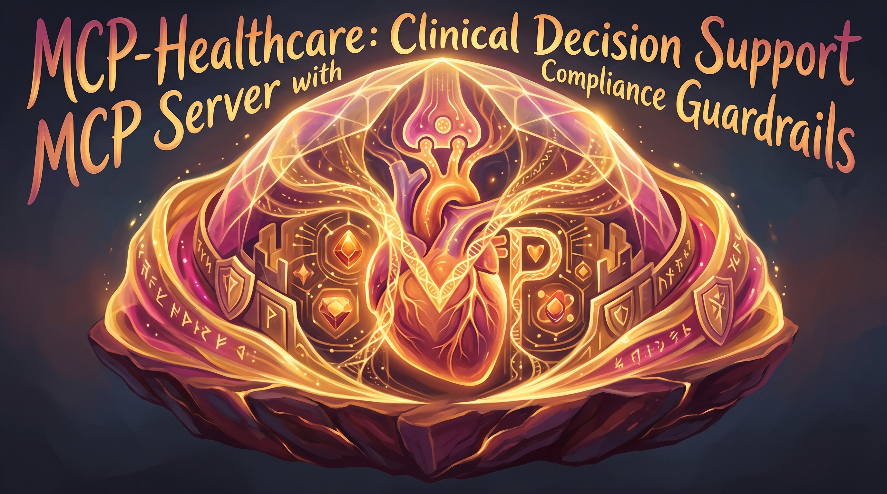

<p align="center">
  
</p>

<h3 align="center">Build an MCP server that provides clinical decision support tools (drug interactions, diagnostic criteria, care pathway recommendations) with built-in HIPAA compliance checks and audit logging. This addresses the gap identified in patient-facing CDS systems while leveraging your MCP expertise and healthcare focus. The server would integrate with your existing Claude-powered agents and use the compliance patterns from SecureML/ContextGraph research.</h3>

<p align="center">
  <a href="#quick-start">Quick Start</a> &bull;
  <a href="#features">Features</a> &bull;
  <a href="#examples">Examples</a> &bull;
  <a href="#contributing">Contributing</a>
</p>

MCP-Healthcare is an offline Model Context Protocol server delivering clinical decision support tools for drug interactions, diagnostic evaluations, and care pathway recommendations. It enforces HIPAA-compliant audit logging and operates without external network calls, making it suitable for air-gapped healthcare environments. The tool targets clinical IT engineers and developers needing auditable CDS capabilities for local AI workflows.

Healthcare environments often require clinical decision support that must operate without external network calls, guaranteeing data locality and HIPAA compliance while integrating with agent-based AI workflows.

| Feature | Description |
|---------|-------------|
| Drug Interaction Checker | Evaluates medication lists against an embedded interaction database returning severity-graded alerts (contraindication, warning, precaution) with audit logging. |
| Diagnostic Criteria Evaluator | Checks clinical observations against rule sets (e.g., sepsis SIRS) returning boolean pass/fail with supporting evidence and audit trails. |
| Care Pathway Recommender | Suggests ordered care steps aligned with local guidelines for a given diagnosis and patient context, logging each recommendation. |
| HIPAA-Compliant Audit Log | Records all CDS queries with timestamp, user ID, and query hash in an immutable append-only SQLite log. |
| Offline-First Operation | Functions entirely without external network calls ensuring data locality and compliance in restricted environments. |

### Quick Start
1. Clone the repository: `git clone https://github.com/m2ai-portfolio/mcp-healthcare.git`
2. Install dependencies: `cd mcp-healthcare && pip install -e .`
3. Set data directory: `export MCP_DATA_DIR=$(pwd)/mcp_healthcare/data`
4. Verify installation: `mcp-healthcare --help`

### Examples
**Check drug interactions**
```bash
$ mcp-healthcare drug-check --medications '[{"name":"warfarin","dose":"5 mg","route":"PO"},{"name":"aspirin","dose":"81 mg","route":"PO"}]'
[
  {
    "severity": "contraindication",
    "description": "Aspirin increases risk of bleeding when combined with warfarin.",
    "source": "Stockley 7e"
  }
]
```

**Evaluate sepsis criteria**
```bash
$ mcp-healthcare diagnostic --observations '{"vitals":{"temperature":38.5,"heart_rate":110,"respiratory_rate":22},"labs":{"wbc":12.5,"lactate":2.1},"history":[]}'
{
  "passed": true,
  "evidence": [
    "Temperature > 38°C",
    "Heart rate > 90 bpm",
    "Respiratory rate > 20/min",
    "WBC > 12,000/mm³",
    "Lactate > 2 mmol/L"
  ]
}
```

**Get pneumonia care pathway**
```bash
$ mcp-healthcare pathway --diagnosis 'pneumonia' --context '{"age":72,"comorbidities":["copd"]}'
[
  {
    "action": "Administer antibiotic",
    "detail": "Ceftriaxone 1g IV daily plus azithromycin 500mg IV daily",
    "estimated_hours": 1
  },
  {
    "action": "Order chest imaging",
    "detail": "PA and lateral chest X-ray",
    "estimated_hours": 2
  },
  {
    "action": "Monitor oxygen saturation",
    "detail": "Continuous SpO2 monitoring target >90%",
    "estimated_hours": 24
  }
]
```

### File Structure
MCP-Healthcare: Clinical Decision Support MCP Server with Compliance Guardrails/
  mcp_healthcare/          # Core source code
    cli.py                 # Click-based command line interface
    drug_checker.py        # Drug interaction logic
    diagnostic.py          # Diagnostic criteria evaluation
    pathway.py             # Care pathway recommendations
    audit.py               # HIPAA-compliant audit logging
    db.py                  # SQLite database abstraction
    models.py              # Pydantic data models
    config.py              # Configuration management
    __main__.py            # Entry point for `python -m mcp_healthcare`
  tests/                   # Test suite
    test_drug_interaction.py
    test_diagnostic.py
    test_pathway.py
    test_audit.py
    test_config.py
  data/                    # Static reference data
    interactions.json      # Drug interaction dataset
    rulesets/              # Diagnostic rule sets
      sepsis_sirs.json
    pathways/              # Care pathway templates
      pneumonia.json
  pyproject.toml           # Project configuration and dependencies
  requirements.txt         # Legacy dependency specification
  README.md

### Tech Stack
| Technology | Purpose |
|------------|---------|
| Python 3.11+ | Core language runtime |
| Click 8.1+ | CLI argument parsing and command handling |
| Pydantic 2.6+ | Data validation and settings management |
| SQLite3 | Embedded database for audit logs and reference data |
| Pytest 8.0+ | Unit and integration testing framework |

### Contributing
Fork the repository, create a feature branch, implement changes, run tests with `pytest`, and submit a pull request.

### License
MIT

### Author
Matthew Snow -- [M2AI](https://m2ai.co) | [@m2ai-portfolio](https://github.com/m2ai-portfolio)